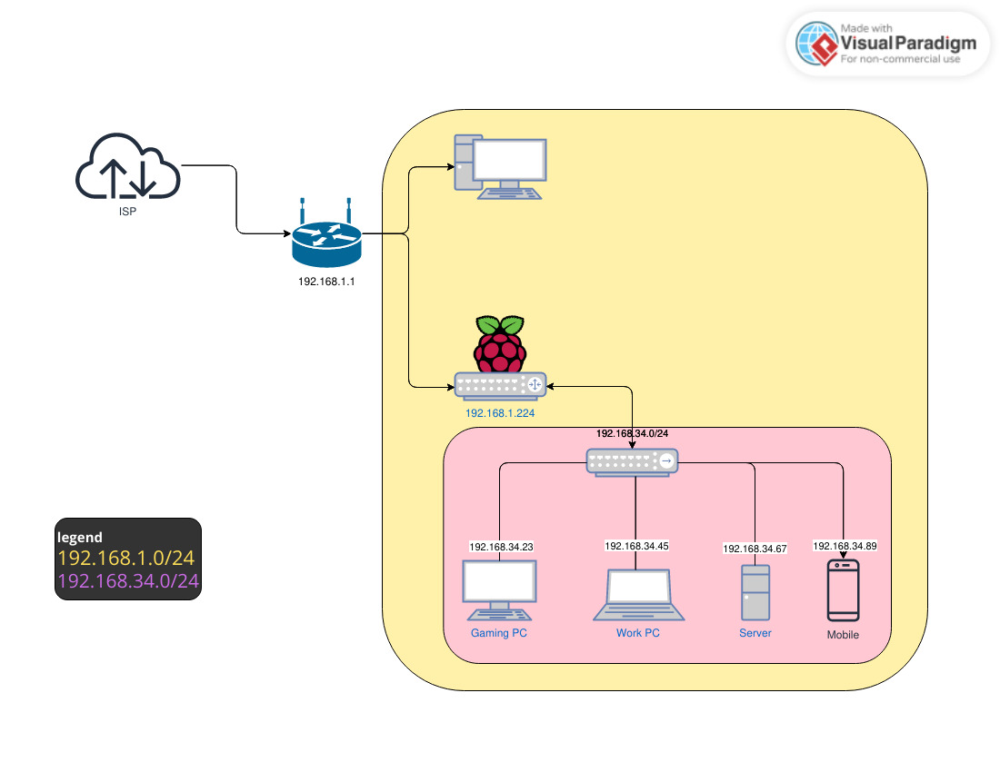

# Travel Router DIY

Imagine yourself in a situation where you in need to use Public WiFi insecure open-network meaning, to the HACKERS as well. But, you cant risk your data, what would you do ?

## Use your own Private Router (you need a raspberry pi 4 though!!)

easy let me explain, See this design first.



*Note: Usual project involve taking Wireless network and Broadcasting another one private Network using external wifi adapter, but I tried using the existing ethernet port for providing the same.*

now you know.

## Requirements/Installation

- Raspberry Pi 4 Model B
- Raspberry Pi OS Lite (bookworm, 64-bit)
- Raspberry Pi Imager
- Your precious Time

## Installation Procedure.

#### No VPN method.

> Follow This

1. Image your Raspberry Pi , [I used this one.](https://downloads.raspberrypi.com/raspios_lite_arm64/images/raspios_lite_arm64-2024-03-15/2024-03-15-raspios-bookworm-arm64-lite.img.xz), you can always experiment with other OS, if you're into that.
   **Don't forgot to setup the Raspberry Pi OS while imaging, meaning setup the username, password amd very important WiFi (the network with which you are gonna ssh into. [*I used headless mode thats why, if you're using DISPLAY output you probably may not need to do this.*]) [refer official documentaion](https://www.raspberrypi.com/documentation/computers/configuration.html#connect-to-a-wireless-network).**
2. Let the Pi reboot and give it some time to get connected to WiFi (the one which you did setup earlier)

   1. you need to find the IP of the Raspberry Pi,
      `ifconfig` then
      `nmap -sn <your-local-ip>/24`
      `ssh <username>@<rasp-pi-local-ip>`
   2. or usually
      `ssh pi@raspberrypi` may or maynot work
3. once after you connected sucessfully to the raspberry pi, do the steps.

   **NOTE: YOU CAN USE ANY PRIVATE SUBNET, UNTILL IT IS VALID PRIVATE ADDRESS.**

> ```bash
>
> sudo vim /etc/dhcpcd.conf
> ```
>
> if the file doesnot exists!!
>
> ```bash
> sudo apt install dhcpcd
> ```
>
> then proceed, add this lines into file
>
> ```
> interface eth0
> static ip_address=10.12.13.1/24
> static routers=10.12.13.1
> static domain_name_servers=8.8.8.8 8.8.4.4
> ```

**note: Comment out everything else in the file [refer the official write-up [1] for more info].**

> ```bash
>
> sudo apt install isc-dhcp-server
> ```
>
> error! ?? don't worry lets debug this on last.

> ```bash
>
> sudo vim /etc/dhcp/dhcpd.conf
> ```
>
> Add this to the bottom of the file:
>
> ```
> authoritative;
> subnet 10.12.13.0 netmask 255.255.255.0 {
> range 10.12.13.10 10.12.13.250;
> option broadcast-address 10.12.13.255;
> option routers 10.12.13.1;
> default-lease-time 600;
> max-lease-time 7200;
> option domain-name "local-network";
> option domain-name-servers 8.8.8.8, 8.8.4.4;
> }
> ```

> ```bash
>
> sudo vim /etc/default/isc-dhcp-server
> ```
>
> add the interface eth0
>
> `INTERFACESv4="eth0"`

> ```bash
> sudo vim /etc/sysctl.conf
> ```
>
> Add this line:
>
> `net.ipv4.ip_forward=1`

> ```bash
> vim isc-server
> ```
>
> ```
> echo "Starting DHCP server"
> service isc-dhcp-server start
>
> echo Setting NAT routing
> iptables -t nat -A POSTROUTING -o wlan0 -j MASQUERADE
> iptables -A FORWARD -i wlan0 -o eth0 -m state --state RELATED,ESTABLISHED -j ACCEPT
> iptables -A FORWARD -i eth0 -o wlan0 -j ACCEPT
>
> DEFAULT_IFACE=`route -n | grep -E "^0.0.0.0 .+UG" | awk '{print $8}'`
> if [ "$DEFAULT_IFACE" != "wlan0" ]
> then
> GW=`route -n | grep -E "^0.0.0.0 .+UG .+wlan0$" | awk '{print $2}'`
> echo Setting default route to wlan0 via $GW
> route del default $DEFAULT_IFACE
> route add default gw $GW wlan0
> fi
> ```
>
> ```bash
> sudo bash isc-server
> ```

> #### Yes VPN Method
>
> ```bash
> sudo apt install openvpn
> ```
>
> Download the .ovpn access file and call the VPN connection:
>
> ```bash
> sudo openvpn {file}.ovpn
> ```
>
> Enter your username and password, wait for the connecton. The VPN
> will be passing all network traffic through a new route: tun0 (as
> opposed to eth0 or wlan0). To account for this, I will create a new file
> based on the previous one and replace all instances of wlan0 with tun0:
>
> ```
> echo Starting DHCP server
> service isc-dhcp-server start
>
> echo Setting NAT routing
> iptables -t nat -A POSTROUTING -o tun0 -j MASQUERADE
> iptables -A FORWARD -i tun0 -o eth0 -m state --state RELATED,ESTABLISHED -j ACCEPT
> iptables -A FORWARD -i eth0 -o tun0 -j ACCEPT
>
> DEFAULT_IFACE=`route -n | grep -E "^0.0.0.0 .+UG" | awk '{print $8}'`
> if [ "$DEFAULT_IFACE" != "tun0" ]
> then
>   GW=`route -n | grep -E "^0.0.0.0 .+UG .+tun0$" | awk '{print $2}'`
>   echo Setting default route to tun0 via $GW
>   route del default $DEFAULT_IFACE
>   route add default gw $GW tun0
> fi
> ```
>
> OG author call this file as `isc-server-vpn`
>
> ```bash
> sudo bash isc-server-vpn
> ```
>
> Now my system will pass the VPN data into the ethernet port, and if the VPN connection fails, all network traffic will stop.

> ## Using systemd to start automagically
>
> Systemd is the default init system in most modern Linux distributions, including Raspberry Pi OS. You can create a systemd service to run your script on startup.
>
> 1. Create a new systemd service file:
>
> ```bash
> sudo nano /etc/systemd/system/start-interneting.service
> ```
>
> 2. Add the following content to the file:
>
> ```
> [Unit]
> Description=starts the actual networking for the raspberry pi
> After=network-online.target
> Wants=network-online.target
>
> [Service]
> ExecStart=/etc/start-interneting
> Restart=on-failure
> User=pi
>
> [Install]
> WantedBy=multi-user.target
> ```
>
> 3. copy start-internetworking script into /etc/
> 4. Save and exit the file.
> 5. Enable and start the service:
>
> ```
> sudo systemctl enable start-interneting.service
> sudo systemctl start start-interneting.service
> ```

> ## Debugging
>
> 1. if you get this error
>
>    ```
>    iot@raspberrypi:~ $ sudo systemctl start isc-dhcp-server
>    Job for isc-dhcp-server.service failed because the control process exited with error code.
>    See "systemctl status isc-dhcp-server.service" and "journalctl -xeu isc-dhcp-server.service" for details.
>    ```
>
>    Don't freak out, it's pretty easy!!
>    make sure all these files are correct and intact `/etc/dhcpcd.conf , /etc/dhcp/dhcpd.conf and /etc/default/isc-dhcp-server`
>
>    ```bash
>    sudo systemctl start dhcpcd
>    ```
>
>    after that,
>
>    ```bash
>    ip a
>    ```
>
>    notice that eth0 is DOWN, goal is to bring it back up.
>    ...
>    `eth0: <NO-CARRIER,BROADCAST,MULTICAST,UP> mtu 1500 qdisc mq state DOWN group default qlen 1000`
>    ..  ...
>
>    up the interface
>
>    ```bash
>    sudo ifconfig eth0 10.10.13.1 netmask 255.255.255.0 up
>    ```
>
>    should become like this
>    `eth0: <BROADCAST,MULTICAST,UP,LOWER_UP> mtu 1500 qdisc mq state UP group default qlen 1000`
>
>    if it doesnt't UP proceed plugging ethernet cable into raspberry port and connect other end to any networking device (i have tried using my laptop's ethernet port)
>
>    now the upper command should work fine.
> 2. if you still have any permission based errors do this.
>
>    ```bash
>    sudo chown root:root /var/lib/dhcp/dhcpd.leases
>    sudo chown root:root /etc/dhcp/dhcpd.conf
>    sudo chmod 644 /etc/dhcp/dhcpd.conf
>    sudo chmod 644 /var/lib/dhcp/dhcpd.leases
>    ```

> ## Reference
>
> [1]. In detail [write up](https://switchedtolinux.com/tutorials/wireless-internet-passed-to-ethernet-with-raspberry-pi)
>
> Keywords: Raspberry Pi Travel Router, Private Router with VPN, Headless mode Raspberry Pi.
